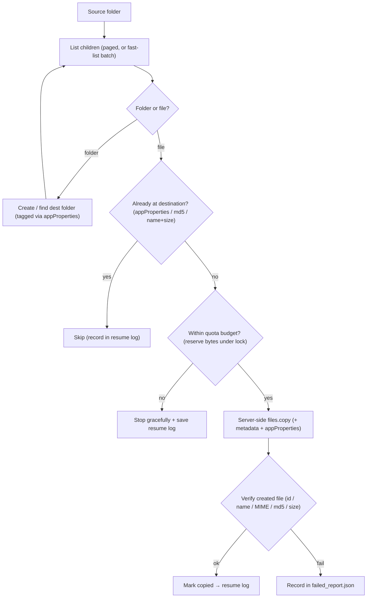
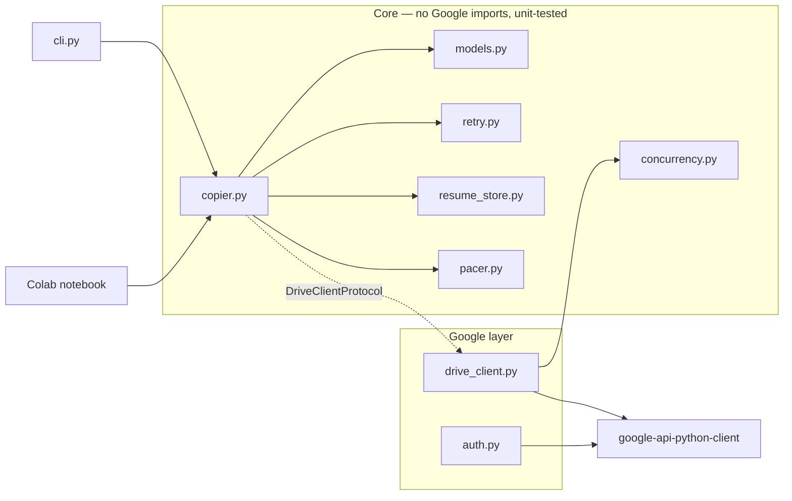

# ⚡ GDrive_Turbo_Copy

[](https://colab.research.google.com/github/ekaznyra/GDrive_Turbo_Copy/blob/main/GDrive_Turbo_Copy.ipynb)
[](https://github.com/ekaznyra/GDrive_Turbo_Copy/actions/workflows/ci.yml)


> **Sao chép thư mục Google Drive → Google Drive siêu tốc** — server-side (không tốn băng thông), đa luồng, **resume** khi bị ngắt, chống trùng và **xác minh sau khi copy**.
>
> A fast, **server-side** Google Drive folder-to-folder copier: no download bandwidth, multi-threaded, resumable, idempotent, and verified after every copy.

**⚠️ Legal / pháp lý:** Chỉ sao chép dữ liệu bạn **có quyền hợp pháp** truy cập. Công cụ **không** copy *permissions, comments, revision history*, và **không** có cơ chế vượt quota hay lạm dụng nhiều tài khoản.

---

## Table of contents

- [Quick start](#quick-start)
- [Why it's fast and safe](#why-its-fast-and-safe)
- [How a copy works](#how-a-copy-works)
- [Architecture](#architecture)
- [Install](#install)
- [Colab usage](#colab-usage)
- [CLI usage](#cli-usage)
- [Resume & idempotency](#resume--idempotency)
- [Safety & non-goals](#safety--non-goals)
- [How it compares](#how-it-compares)
- [Running tests](#running-tests)
- [Limitations](#limitations)
- [Troubleshooting](#troubleshooting)
- [License](#license)

## Quick start

**Colab (no install):** open the [notebook](https://colab.research.google.com/github/ekaznyra/GDrive_Turbo_Copy/blob/main/GDrive_Turbo_Copy.ipynb) → run **Install** → paste your **source** and **destination** folder links in **Input** → run **Run**.

**CLI:**

```bash
pip install "git+https://github.com/ekaznyra/GDrive_Turbo_Copy.git"

gdrive-turbo-copy \
  --source "https://drive.google.com/drive/folders/SOURCE_ID" \
  --dest   "https://drive.google.com/drive/folders/DEST_ID" \
  --dry-run          # preview first; drop this to actually copy
```

Interrupted? Just run the same command again — it resumes and skips what's already copied.

## Why it's fast and safe

| Fast 🚀 | Safe 🛡️ |
|---|---|
| **Server-side `files.copy`** — Google copies on its servers, zero download/upload bandwidth | **Idempotent**: re-runs detect & skip copied items via `appProperties` even if the log is gone |
| **Multi-threaded** (1–16 workers) with **adaptive** back-off/recovery | **Post-copy verification** of every file (id / name / MIME / md5 / size) before marking done |
| **Adaptive rate pacing** (AIMD token bucket): starts at ~10 req/s, auto-tunes down on throttling and back up on success | **Resume log** is schema-versioned, **SHA-256 integrity-hashed**, written atomically |
| **Global `Retry-After` cooldown** — when Drive says "slow down", *all* workers wait out the window together | **Quota guard** reserves bytes under a lock and **stops gracefully** before the cap |
| **`--fast-list`** ORs up to 50 sibling folders into one list call on wide trees | **Never silently skips** a folder (multi-parent listing has a per-folder fallback) |
| Minimal API payloads via field masks | **Circuit breaker** bails after sustained rate-limiting instead of hammering for 24h |

Also: Shared Drive support, shortcut resolution + loop detection, metadata fidelity (`modifiedTime`/`description`), exclude filters, dry-run, and a `failed_report.json` for anything that couldn't be copied.

## How a copy works



Transient errors (429, 5xx, rate limits) are retried with **full-jitter exponential backoff** honoring `Retry-After`. Every throttle also feeds back into the **adaptive pacer** (lower the sustained rate now, recover later) and — when a `Retry-After` is present — opens a **global cooldown** so every worker pauses together. Fatal errors (permission, missing, storage/daily quota) are **never retried** and are reported.

## Architecture

The engine is split so the **core logic imports no Google libraries** — it depends on a `DriveClientProtocol`, so it's fully unit-testable with a mocked client and **no credentials**. Google specifics live only in `drive_client.py` and `auth.py`.



| Module | Responsibility |
|---|---|
| [`models.py`](src/gdrive_turbo_copy/models.py) | Dataclasses, enums, constants, `DriveClientProtocol`, config validation |
| [`retry.py`](src/gdrive_turbo_copy/retry.py) | Error classification, full-jitter backoff, `Retry-After`, structured retry events |
| [`pacer.py`](src/gdrive_turbo_copy/pacer.py) | Adaptive (AIMD) token-bucket rate limiter + global `Retry-After` cooldown |
| [`concurrency.py`](src/gdrive_turbo_copy/concurrency.py) | Adaptive, per-operation concurrency control |
| [`resume_store.py`](src/gdrive_turbo_copy/resume_store.py) | Atomic, integrity-hashed, schema-migrating resume log |
| [`drive_client.py`](src/gdrive_turbo_copy/drive_client.py) | Real Drive API client (Google libs live here + `auth.py`) |
| [`auth.py`](src/gdrive_turbo_copy/auth.py) | Colab / ADC / service-account auth (lazy imports, no secrets in code) |
| [`copier.py`](src/gdrive_turbo_copy/copier.py) | The copy engine + pure duplicate detection (`DestinationIndex`) |
| [`cli.py`](src/gdrive_turbo_copy/cli.py) | Command-line interface |

## Install

```bash
# From the repo
pip install "git+https://github.com/ekaznyra/GDrive_Turbo_Copy.git"

# For development (editable + tests + linter)
git clone https://github.com/ekaznyra/GDrive_Turbo_Copy.git
cd GDrive_Turbo_Copy
pip install -e ".[dev]"
```

## Colab usage

1. Open the notebook via the **Open In Colab** badge above.
2. Run the **Install** cell, then fill the **Input** form:
   - **Drive của bạn (đích)** — destination folder link (in *your* Drive).
   - **Drive nguồn** — source folder link.
   - Optional: rate limit, max size (GB), exclude fragments, workers, duplicate-check mode, metadata, fast-list, dry-run.
3. Run the **Run** cell and authorize Drive access when prompted. Progress streams into a live log panel and a styled result card.

The notebook is a **thin wrapper** that imports this package, so the Colab UI and the CLI share identical behavior.

## CLI usage

```bash
gdrive-turbo-copy \
  --source "https://drive.google.com/drive/folders/SOURCE_ID" \
  --dest   "https://drive.google.com/drive/folders/DEST_ID" \
  --workers 4 \
  --verify-mode checksum \
  --max-size-gb 730 \
  --dry-run
```

Outside Colab, authentication uses Application Default Credentials or a service
account: pass `--no-colab` and either run `gcloud auth application-default login`
or set `GDRIVE_SERVICE_ACCOUNT_FILE=/path/key.json`. No secrets are stored in code.

| Flag | Default | Meaning |
|---|---|---|
| `--workers` | `4` | Parallel workers (1–16; >8 warns). |
| `--max-size-gb` | `730` | Stop before copying more than this; `0` = unlimited. |
| `--max-tps` | `10` | Rate **ceiling** (req/s); the pacer auto-tunes the sustained rate down on throttling and back up on success. `0` disables pacing. |
| `--verify-mode` | `checksum` | `checksum` (strict md5), `name_size`, or `name_only`. |
| `--exclude` | – | Comma-separated name fragments to skip (`tmp,.log`). |
| `--from-page` / `--to-page` | `0` | Paginate the **root** folder's direct children (`0` = no limit). |
| `--allow-name-only` | off | Permit unsafe name-only matching. |
| `--no-preserve-metadata` | off | Don't copy `modifiedTime`/`createdTime`/`description`. |
| `--ignore-default-visibility` | off | Bypass a domain default-sharing policy on the copies. |
| `--keep-revision-forever` | off | Pin the copy's head revision (binary files; uses storage). |
| `--fast-list` | off | Batch sibling folders into one list call — faster on wide trees (opt-in). |
| `--dry-run` | off | Preview only. |

## Resume & idempotency

Progress is saved to `.gdrive_copy_resume.<account>.json` in the destination root, holding the schema version, account, source/destination root IDs, run ID, copied file IDs, folder map, copied bytes, failed items, `updated_at`, and a **SHA-256 integrity hash**. On load the hash is verified — a corrupted log is rejected rather than silently skipping files. Logs from multiple accounts in the same destination are merged.

Independently of the log, every copied file carries `appProperties` (`source_file_id`, `source_md5`, `copied_by_tool`) and every created folder carries `source_folder_id`, so re-runs detect and skip already-copied items **even if the log is deleted**. Logs are only cleaned up (moved to **trash**, never permanently deleted) after a fully successful run.

## Safety & non-goals

- **Verified, not assumed:** each copy is re-fetched and checked before being marked done; Google-native Docs/Sheets/Slides (no md5/size) are verified by id + MIME + name + appProperties.
- **Stops before the wall:** a byte budget (default 730 GB) reserved under a lock, plus a circuit breaker that bails after sustained rate-limiting — both save progress and tell you when to retry.
- **Never silently skips:** the optional fast-list path re-lists any folder individually if a batch comes back empty/under-count.
- **Not copied (by design):** sharing permissions, comments, revision history.
- **Explicitly out of scope:** multi-account / service-account rotation, `quotaUser` tricks, or any other quota-evasion / ToS-violating mechanism.

## How it compares

| | **GDrive_Turbo_Copy** | rclone | gdrive-copy (Apps Script) |
|---|---|---|---|
| Server-side Drive→Drive copy | ✅ | ✅ | ✅ |
| Zero-setup in Colab | ✅ (notebook) | ⚠️ install/config | ✅ (web app) |
| Resume after interruption | ✅ integrity-hashed log + appProperties | ✅ | ✅ |
| Post-copy verification | ✅ per file | ⚠️ via flags | ❌ |
| Proactive pacing + adaptive concurrency | ✅ | ✅ pacer | ❌ |
| Embeddable Python package + tests | ✅ | ❌ (Go binary) | ❌ |
| General multi-cloud / sync | ❌ (Drive→Drive only) | ✅ | ❌ |

Use **rclone** if you need a general multi-backend sync engine. Use this when you want a **purpose-built, resumable, verified, Colab-friendly Drive→Drive folder copier** you can also import as a library.

## Running tests

Tests mock all Drive calls — **no real credentials are needed**.

```bash
pip install -e ".[dev]"
pytest -q              # run the suite
ruff check src tests   # lint
```

CI runs the same lint + tests on Python 3.9–3.12.

## Limitations

- **Not copied:** sharing permissions, comments, revision history (by design).
- Google enforces a **~750 GB/day** upload+copy quota per account; server-side `files.copy` also has its own (lower) effective ceiling and a per-second rate. The byte guard (default 730 GB) and the rate-limit circuit breaker stop gracefully on either signal, and the run resumes later.
- Pagination (`from-page`/`to-page`) applies only to the **root** folder's direct children; subfolders are always traversed in full.
- `createdTime` is sent best-effort; Drive often assigns a fresh creation time on copy.

### Deferred / future work

Intentionally left out for now (correctness/effort trade-offs); contributions welcome:

- **Mid-folder resume cursor**: persist each folder's `pageToken` so a crash inside a huge folder resumes mid-page instead of re-listing it.
- **Shared-drive `corpora=drive` scoping** and **gzip transport** tuning (efficiency only).

## Troubleshooting

| Symptom | Cause / fix |
|---|---|
| Stops with a "quota" message | Daily copy/upload limit reached. Re-run after ~24h; the resume log continues automatically. |
| `Destination equals or is inside the source tree` | Choose a destination **outside** the source folder. |
| `permission to add files to the destination` | The preflight check found the destination unwritable — pick a folder you own/can edit. |
| Many `cannotAccessShortcutTarget` failures | Shortcuts point to files you can't access; see `failed_report.json`. |
| Re-running re-copies files | Ensure the destination still contains the prior copies (detected via `appProperties`/checksum) and that the resume log wasn't deleted. |
| `Resume log integrity hash mismatch` | A log was corrupted; the tool refuses it to avoid skipping files. Trash the bad `.gdrive_copy_resume.*.json` and re-run. |
| Rate-limit warnings in logs | Normal under load — the pacer + adaptive workers throttle automatically. Lower `--workers` or `--max-tps` if persistent. |

## License

[MIT](LICENSE)
